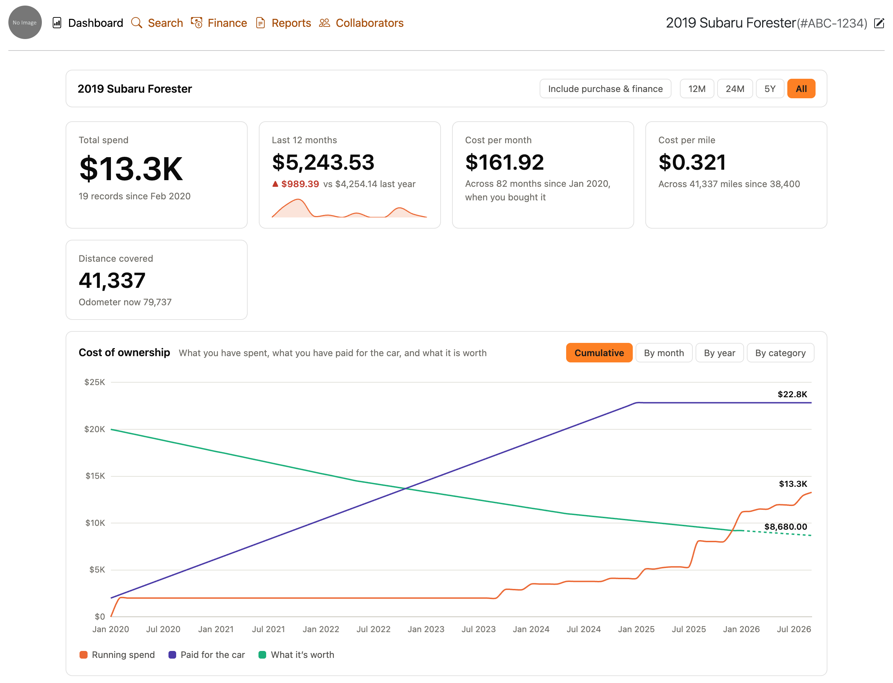

<p align="center">
  
</p>

<h1 align="center">Road Track</h1>

<p align="center">
  <strong>What every car in the garage really costs, on top of LubeLogger.</strong><br>
  A running-cost dashboard, a finance tab and printable reports for the self-hosted LubeLogger vehicle tracker, added over its published image without forking it.
</p>

<p align="center">
  <a href="https://norvitech.com"></a>
  <a href="https://github.com/spencercnorton/roadtrack/actions/workflows/ci.yml"></a>
  <a href="https://github.com/spencercnorton/roadtrack/tags"></a>
  <a href="#install"></a>
  <a href="LICENSE"></a>
  <a href="https://buy.stripe.com/8x26oH2U44f65TRe574wM04"></a>
</p>

<p align="center">
  <picture>
    <source media="(prefers-color-scheme: dark)" srcset="docs/assets/dashboard-dark.png">
    
  </picture>
  <br>
  <sub>Demonstration data from the project's preview fixtures, not a real vehicle.</sub>
</p>

Road Track turns [LubeLogger](https://github.com/hargata/lubelog) — a self-hosted
tracker for vehicle maintenance, fuel and records — into a picture of what each car
costs to own: per month, per mile, by system, and including the loan. It is for
anyone who already keeps their receipts in LubeLogger, or wants to. It runs as a
container image that is LubeLogger's own, plus a layer of browser-side files.

## What it does

**A dashboard for what a car costs, not what it burns.** The vehicle Dashboard tab
shows running cost per month and per mile, spend by category and by system, the
biggest expenses and the distance driven. It reads sensibly for a garage that logs
no fuel at all, where LubeLogger's own dashboard reports zero miles.

**Lifetime figures start the day you bought the car.** Give a vehicle its purchase
date and the odometer reading that day, and the previous owner's receipts and miles
drop out of your cost per mile. Odometer readings are cleaned of mis-keyed and
out-of-order values before anything is measured from them.

**A Finance tab for the car itself.** Price, deposit, rate and term give a payment
schedule that ends at exactly zero; valuations you type in, or per-model
depreciation curves, draw what it has been worth since. One toggle folds purchase
and finance into the dashboard's totals.

**Named, printable reports.** Routine maintenance, full records and a cost summary
are reports you choose by name instead of a column picker, with a toggle that hides
prices, and the same printed page from a phone as from a laptop.

**Sharing you can see.** Every vehicle gets a Collaborators tab, and administrators
get an Access grid of who sees which car — inherited access included — changed with
a checkbox through LubeLogger's own endpoints and rules.

**Finished, not configured.** The theme in light and dark, the icons, an installable
web app and the phone layouts come in the image; the only settings are LubeLogger's,
plus an optional "Add a receipt" button for an instance that files receipts from
Telegram or e-mail.

## Install

### Docker — Docker Compose

```bash
curl -fsSLO https://raw.githubusercontent.com/spencercnorton/roadtrack/main/docker-compose.example.yml
mv docker-compose.example.yml docker-compose.yml
docker compose up -d
```

Then open `http://localhost:8080`. Out of the box LubeLogger has no sign-in: turn it
on in **Settings**, or connect an OpenID Connect provider, before the instance is
reachable by anyone else — see the [configuration guide](docs/configuration.md).

### Already running LubeLogger

Road Track keeps LubeLogger's data exactly as it is. Change the `image:` of your
LubeLogger service to `ghcr.io/spencercnorton/roadtrack:latest`, keep its volumes,
add the two logo variables from the example file, and recreate the container.
Switching back is the same change in reverse. Each release says which LubeLogger
version it is built on; do not switch from a newer LubeLogger to an older one.

### From source

```bash
git clone https://github.com/spencercnorton/roadtrack.git
cd roadtrack
docker build -t roadtrack .
docker run --rm -p 8080:8080 -v roadtrack-data:/App/data roadtrack
```

The container image is the only package; there is no other install channel.

## Documentation

- [User guide](docs/user-guide.md) — the dashboard, the Finance tab, reports, collaborators and the Access grid.
- [Configuration](docs/configuration.md) — every setting, the fields Road Track adds, reverse proxies and caching.
- [Operations](docs/operations.md) — upgrades, pinning and rollback, backups, single sign-on hardening.
- [How it works](docs/how-it-works.md) — how the layer is applied without forking LubeLogger.
- [Development](docs/development.md) — the checks, the preview harness, and working against upstream's markup.
- [Releasing](docs/RELEASING.md) — how a release is cut and published.
- [`CHANGELOG.md`](CHANGELOG.md) — what changed in each release.

## Where your data lives

| Path | Purpose |
|---|---|
| `/App/data` (volume) | LubeLogger's database, documents, images and settings: every vehicle and record, including the fields Road Track adds |
| `/root/.aspnet/DataProtection-Keys` (volume) | the keys that sign sign-in cookies |
| `/App/wwwroot/brand/config.json` | written at start from the `ROADTRACK_*` settings; holds no vehicle data |

Road Track stores nothing of its own, and its pages talk only to the instance that
serves them. Nothing leaves the machine unless someone presses a receipt link, and
there is no telemetry.

## Contributing and support

- Bugs and feature requests: [open an issue](https://github.com/spencercnorton/roadtrack/issues/new/choose). Questions: [Discussions](https://github.com/spencercnorton/roadtrack/discussions).
- Security reports: [private vulnerability reporting](https://github.com/spencercnorton/roadtrack/security/advisories/new) — see [SECURITY.md](SECURITY.md). There is no e-mail address; that is deliberate.
- Pull requests are welcome; read [CONTRIBUTING.md](CONTRIBUTING.md) first — changes are reviewed and merged on GitHub, then shipped in tagged releases.
- If Road Track saves you time, you can [support its development](https://buy.stripe.com/8x26oH2U44f65TRe574wM04).

## Development

```bash
python3 tools/check.py           # brand assets: contrast, SVGs, CSS, rasters, manifest
node tools/test_metrics.mjs      # the money and distance maths
sh tools/test_entrypoint.sh      # the runtime settings the entrypoint accepts and refuses
sh tools/test_build_guard.sh     # Docker: the build fails when upstream moves a file
sh tools/smoke_test.sh           # Docker: build the image, start it, probe what it serves
```

## Licence

[MIT](LICENSE) © Spencer Norton

Road Track runs over [LubeLogger](https://github.com/hargata/lubelog) by Hargata
Softworks, which is also MIT-licensed. It is a layer, not a fork: LubeLogger's
code is unchanged, its credit and funding link stay in the app's About panel, and
its licence travels in [`NOTICE`](NOTICE) and inside the image.

---

<p align="center">
  <a href="https://norvitech.com"></a>
</p>

<p align="center">
  <a href="https://github.com/spencercnorton/helios">Helios</a> ·
  <a href="https://github.com/spencercnorton/bitagent">BitAgent</a> ·
  <a href="https://github.com/spencercnorton/xnote">XNote</a> ·
  <a href="https://github.com/spencercnorton/xnote-placement">XNote Placement</a> ·
  <a href="https://github.com/spencercnorton/snipsnap">SnipSnap</a> ·
  <a href="https://github.com/spencercnorton/conductor">Conductor</a> ·
  <a href="https://github.com/spencercnorton/roadtrack">Road Track</a> ·
  <a href="https://norvitech.com">norvitech.com</a>
</p>
